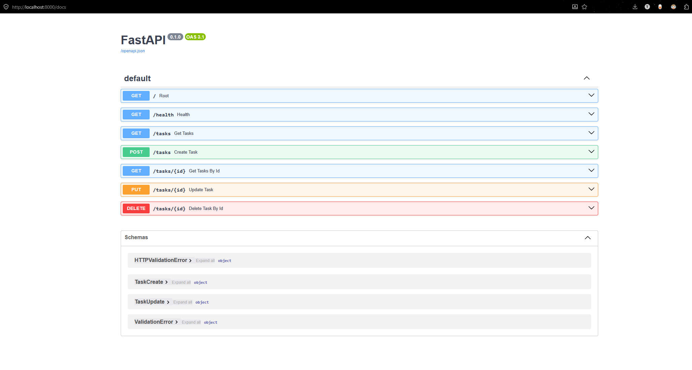

# Task API

FastAPI CRUD to-do list (in-memory) done as an exercise for the AI Back-end track.

## Requirements

- Python 3.10+

## Install & run

```bash
python -m venv .venv
source .venv/Scripts/activate
pip install -r requirements.txt
uvicorn main:app --reload --port 8000
```

Then open:

- API: http://localhost:8000
- Swagger UI: http://localhost:8000/docs

## Endpoints

| Method | Path | Description |
|--------|------|-------------|
| GET | `/` | API info (name, version, endpoints) |
| GET | `/health` | Health check |
| POST | `/reset` | Restore the 3 seed tasks |
| GET | `/tasks` | List all tasks (?done=true|false, ?search=...) |
| GET | `/tasks/stats` | Counts: total, done, pending |
| GET | `/tasks/{id}` | Get a task by ID |
| POST | `/tasks` | Create a new task |
| PUT | `/tasks/{id}` | Update a task |
| DELETE | `/tasks/{id}` | Delete a task |

## Example

```bash
curl -i http://localhost:8000/tasks
```

```
HTTP/1.1 200 OK
date: Mon, 27 Jul 2026 15:16:07 GMT
server: uvicorn
content-length: 116
content-type: application/json

[{"id":1,"title":"Task 1","done":true},{"id":2,"title":"Task 2","done":false},{"id":3,"title":"Task 3","done":true}]
```

## Swagger UI



## AI rematch (`ai-version/`)

Bonus Stage 7: the same Task API regenerated by an AI assistant, kept in quarantine under `ai-version/` so the hand-built `main.py` stays untouched.

### Run the AI version

```bash
source .venv/Scripts/activate
cd ai-version
uvicorn main:app --reload --port 8001
```

- API: http://localhost:8001
- Swagger UI: http://localhost:8001/docs

### Prompt used

```
Goal: You'll build an API that manages a to-do list, by creating tasks, reading, updating, and deleting them. Then update the README to contain what you have done, apart from the current contents of the readme, meaning you'll only add.

Description: You'll do it using FastAPI, meaning it comes already with swagger documentation, but you'll add one-line descriptions to it. The project is already set on github, so you'll only have to commit. You'll be limited to changing only files inside "ai-version/" folder, for the exception of README.md. No database will be used, only in-memory.

The task:
Create 5 main calls, GET for all tasks and each task, a POST for creating a task, a PUT for updating a task, and a DELETE for deleting a task.

But also create GETs for health check and api info.

Make error exceptions properly, as in, 201 when creating, 200 when getting, 404 if unknown id. 400 for bad requests as missing data.

Feel free to add extras such as filtering by query parameters, searching with query parameters, and a post to reset all tasks to their original state.
```

### AI vs me

**What the AI did better**
- Uses `HTTPException` + small helpers (`_find_task`, `_next_id`) instead of repeating loops and `JSONResponse` in every route — easier to read and harder to mistype a status code.
- DELETE returns a real **204 with an empty body** (`Response(status_code=204)`). My hand-built version declared `status_code=204` but still tried to send a JSON message body, which fights the meaning of 204.
- `_next_id()` safely handles an empty list after every task is deleted. My version would crash on `max(...)` if `tasks` were empty.

**What it got wrong or decided differently**
- Error JSON is wrapped as `{"detail": {"error": "..."}}` because FastAPI's `HTTPException` always puts the payload under `detail`. My hand-built API returns the flatter `{"error": "..."}` that the assignment examples show.
- The prompt did not mention a stats endpoint; the AI still added `GET /tasks/stats` (same extra I had built by hand). It also chose port **8001** in the README so both servers can run side by side — that was never specified.

**What the prompt forgot to specify**
- Exact error body shape (`{"error": "..."}` vs FastAPI's `detail` wrapper), seed task titles, and whether DELETE must return an empty body. One rematch takeaway: name the response contract as precisely as the status codes, or the AI will fill the gaps with framework defaults.

**One rematch note:** tightening the prompt around "404 body must be exactly `{ \"error\": \"Task N not found\" }` with no `detail` wrapper" and "204 must have zero body" would close the two biggest silent diffs.
