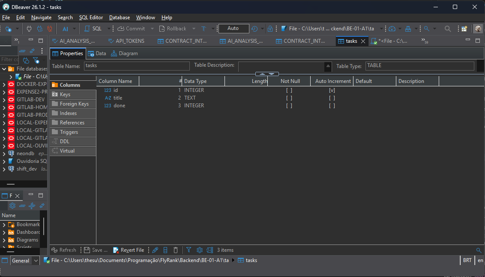
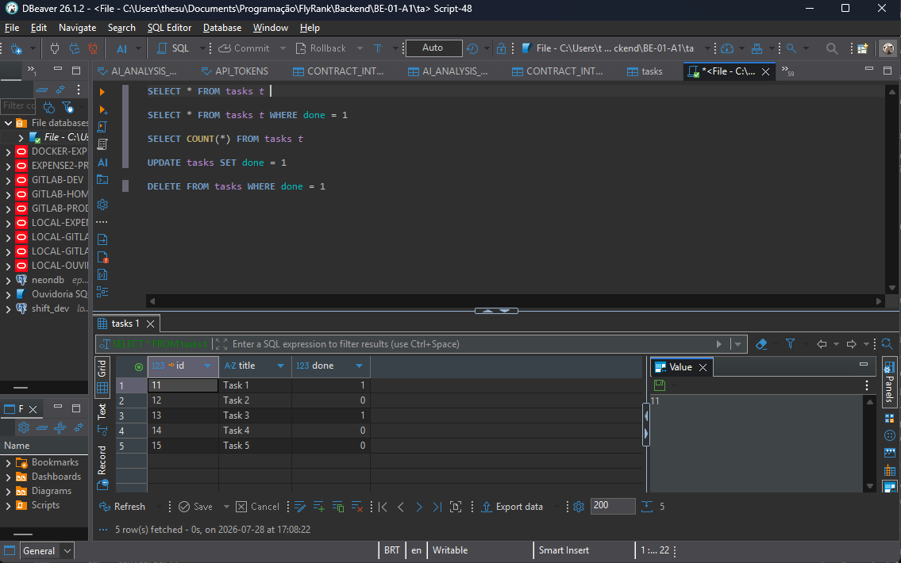

# Task API

FastAPI CRUD to-do list with SQLite done as an exercise for the AI Back-end track.

## Requirements

- Python 3.10+

## Database

SQLite was chosen as it requires no extra steps for it's usage. As it's a simple project, it being a single file is perfect for the current complexity, and it does its purpose of retaining the data through server restarts.

The database open in DBeaver:


Running a query for fetching all items in the database:


### Adding Timestamps

`created_at` and `updated_at` are stored in SQLite but not returned by the API, by choice.

Changing `CREATE TABLE` only affects **new** database files. An existing `tasks.db` keeps the old schema. For this project, delete `tasks.db` and restart the app (it recreates and seeds itself). In larger apps you'd use a migration tool (`ALTER TABLE` / Alembic) instead of deleting data.

## Install & run

```bash
python -m venv .venv
source .venv/Scripts/activate
pip install -r requirements.txt
uvicorn main:app --reload --port 8000
```

Then open:

- API: http://localhost:8000
- Swagger UI: http://localhost:8000/docs

## Endpoints

| Method | Path | Description |
|--------|------|-------------|
| GET | `/` | API info (name, version, endpoints) |
| GET | `/health` | Health check |
| POST | `/reset` | Restore the 3 seed tasks |
| GET | `/tasks` | List all tasks (?done=true|false, ?search=...) |
| GET | `/tasks/stats` | Counts: total, done, pending |
| GET | `/tasks/{id}` | Get a task by ID |
| POST | `/tasks` | Create a new task |
| PUT | `/tasks/{id}` | Update a task |
| DELETE | `/tasks/{id}` | Delete a task |

## Example

```bash
curl -i http://localhost:8000/tasks
```

```
HTTP/1.1 200 OK
date: Mon, 27 Jul 2026 15:16:07 GMT
server: uvicorn
content-length: 116
content-type: application/json

[{"id":1,"title":"Task 1","done":true},{"id":2,"title":"Task 2","done":false},{"id":3,"title":"Task 3","done":true}]
```

## Swagger UI


## AI rematch (`ai-version/`)

Bonus Stage 7: the same Task API regenerated by an AI assistant, kept in quarantine under `ai-version/` so the hand-built `main.py` stays untouched.

- **A1** — in-memory rematch (first prompt).
- **A2** — SQLite rematch (second prompt; `ai-version/main.py` now matches this stage).

### Run the AI version

```bash
source .venv/Scripts/activate
cd ai-version
uvicorn main:app --reload --port 8001
```

- API: http://localhost:8001
- Swagger UI: http://localhost:8001/docs

### A1

#### Prompt used

```
Goal: You'll build an API that manages a to-do list, by creating tasks, reading, updating, and deleting them. Then update the README to contain what you have done, apart from the current contents of the readme, meaning you'll only add.

Description: You'll do it using FastAPI, meaning it comes already with swagger documentation, but you'll add one-line descriptions to it. The project is already set on github, so you'll only have to commit. You'll be limited to changing only files inside "ai-version/" folder, for the exception of README.md. No database will be used, only in-memory.

The task:
Create 5 main calls, GET for all tasks and each task, a POST for creating a task, a PUT for updating a task, and a DELETE for deleting a task.

But also create GETs for health check and api info.

Make error exceptions properly, as in, 201 when creating, 200 when getting, 404 if unknown id. 400 for bad requests as missing data.

Feel free to add extras such as filtering by query parameters, searching with query parameters, and a post to reset all tasks to their original state.
```

#### AI vs me

**What the AI did better**
- Uses `HTTPException` + small helpers (`_find_task`, `_next_id`) instead of repeating loops and `JSONResponse` in every route — easier to read and harder to mistype a status code.
- DELETE returns a real **204 with an empty body** (`Response(status_code=204)`). My hand-built version declared `status_code=204` but still tried to send a JSON message body, which fights the meaning of 204.
- `_next_id()` safely handles an empty list after every task is deleted. My version would crash on `max(...)` if `tasks` were empty.

**What it got wrong or decided differently**
- Error JSON is wrapped as `{"detail": {"error": "..."}}` because FastAPI's `HTTPException` always puts the payload under `detail`. My hand-built API returns the flatter `{"error": "..."}` that the assignment examples show.
- The prompt did not mention a stats endpoint; the AI still added `GET /tasks/stats` (same extra I had built by hand). It also chose port **8001** in the README so both servers can run side by side — that was never specified.

**What the prompt forgot to specify**
- Exact error body shape (`{"error": "..."}` vs FastAPI's `detail` wrapper), seed task titles, and whether DELETE must return an empty body. One rematch takeaway: name the response contract as precisely as the status codes, or the AI will fill the gaps with framework defaults.

**One rematch note:** tightening the prompt around "404 body must be exactly `{ \"error\": \"Task N not found\" }` with no `detail` wrapper" and "204 must have zero body" would close the two biggest silent diffs.

#### Prompt rating: 7/10

Solid for a first rematch prompt — clear enough to get a working API, not precise enough to lock the response contract.

**What the prompt got right**
- Scope quarantine: `ai-version/` only (+ README append) — the most important Stage 7 constraint.
- Stack + storage: FastAPI, in-memory, no DB — no room for the AI to invent a database.
- CRUD + status codes: 201 / 200 / 404 / 400 named explicitly.
- Swagger note: one-line descriptions — shows docs come from the code.
- Extras as optional: "feel free" keeps stretch goals from becoming mandatory noise.

**Where it was weak**
- Paths never named. Said "GET for all tasks" but not `GET /tasks` or `GET /tasks/{id}` — an AI could invent `/todos` or `/api/v1/tasks`. It matched by luck/training, not because the prompt forced it.
- Error body shape missing. Status codes without payload shape = incomplete API contract (hence FastAPI's `detail` wrapper).
- DELETE incomplete: no `204` + empty body required.
- Validation rules fuzzy: missing title vs empty string `""` vs whitespace-only vs PUT with `{}`.
- Seed data unspecified: "original state" for `/reset` needs the 3 seed tasks defined.
- Process mixed with product: commit instructions belong in workflow, not in the API spec.
- Root/health payloads unspecified (`Task API` / `{ "status": "ok" }`).

**If only one paragraph could be rewritten to raise this to a 9:** the paths. Without exact URLs, the whole contract floats — that is the main purpose of the task.

### A2

#### Prompt used

```
Goal: You'll build an API that manages a to-do list, by creating tasks, reading, updating, and deleting them. Then update the README to contain what you have done, apart from the current contents of the readme, meaning you'll only add.

Description: You'll do it using FastAPI, meaning it comes already with swagger documentation, but you'll add one-line descriptions to it. The project is already set on github, so you'll only have to commit. You'll be limited to changing only files inside "ai-version/" folder, for the exception of README.md. You'll use SQLite3, which already comes with FastApi

The task:
Create 5 main calls, GET /tasks and GET/tasks{id}, a POST for creating a task, a PUT for updating a task, and a DELETE for deleting a task.

The jsons must follow this JSON pattern: { "key": "value" }

Here's a seed for you to follow on how I want the data:
"
    {"id": 1, "title": "Task 1", "done": True, "created_at": datetime.now(), "updated_at": datetime.now()},
    {"id": 2, "title": "Task 2", "done": False, "created_at": datetime.now(), "updated_at": datetime.now()},
    {"id": 3, "title": "Task 3", "done": True, "created_at": datetime.now(), "updated_at": datetime.now()},
"

But also create GETs for health check and api info.

Health should return status, and api info as much info as you like without being verbose

Make error exceptions properly, as in, 201 when creating, 200 when getting, 404 if unknown id. 400 for bad requests as missing data, 204 when deleting.

Feel free to add extras such as filtering by query parameters, searching with query parameters, and a post to reset all tasks to their original state.

For the reset, if done, you have the default tasks above.

You'll also have another small task which is, in the readme, you'll create a section for A1 and A2, separate from ###Prompt used and below to inside A1, and make the same thing done there for A2 but regardind all the new data.
```

#### AI vs me

**What the AI did better**
- `/reset` actually clears and re-seeds **SQLite** (including `sqlite_sequence` so IDs go back to 1–3). The hand-built `/reset` only rewrote the leftover in-memory list and left `tasks.db` untouched.
- `/tasks/stats` reads counts from the database. The hand-built stats endpoint still summed the in-memory list after the CRUD moved to SQLite.
- PUT checks that the row exists and returns **404** before updating. The hand-built PUT would blow up (or update nothing useful) if the id was missing.
- Keeps A1 habits that still help with a DB: `HTTPException`, real empty-body **204**, and `summary=` one-liners for Swagger.

**What it got wrong or decided differently**
- Same A1 `detail` wrapper: errors look like `{"detail": {"error": "..."}}` instead of the flatter `{"error": "..."}` from the hand-built API.
- `created_at` / `updated_at` are stored in SQLite (as the seed suggests) but not returned in JSON responses — same product choice as the hand-built API / README note, not a prompt-forced contract.
- Added `GET /tasks/stats` again even though A2 did not require it (same stretch as A1).

**What the prompt forgot to specify**
- Whether timestamps must appear in API responses or only in the DB.
- Exact error body shape (still the biggest silent contract gap from A1).
- Where `tasks.db` should live (`ai-version/` vs project root) when both servers can run.

**One rematch note:** saying "persist with SQLite; API JSON is `{id, title, done}` only; timestamps stay in the DB" would remove the biggest A2 ambiguity.

#### Prompt rating: 8/10

Stronger than A1 because paths, seed data, SQLite, and **204** are explicit — the main A1 failure mode is mostly fixed.

**What the prompt got right**
- Named routes: `GET /tasks` and `GET /tasks/{id}` (typo aside) lock the URL contract.
- Seed with ids/titles/done + timestamps gives `/reset` a real target.
- Storage constraint flipped clearly: SQLite instead of in-memory.
- DELETE **204** called out this time.
- README structure task (A1 / A2) keeps the rematch write-up organized.

**Where it was weak**
- Path typo: `GET/tasks{id}` missing `/` and braces style — still readable, still sloppy for a contract.
- Error payload shape still missing (`error` vs `detail`).
- Timestamp visibility in responses unspecified.
- "JSON pattern `{ \"key\": \"value\" }`" is too vague to constrain field names/types beyond the seed.
- Commit / README formatting mixed into the product prompt again.

**If only one paragraph could be rewritten to raise this to a 9:** lock the response contract — status codes **and** body shapes for 400/404/201, plus whether timestamps are public fields.
